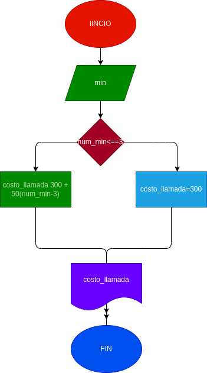

# llamada_telef-nica
ingressar el tiempo de duración de una llamada telefonica y determinar la cantidad a pagar, de acuerdo con lo siguiente:

- toda llamada que dure 3 minutos o menos tiene un costo de 300 pesos
- cada minuto adicional cuesta 50 pesos

# diseño
## diagrama de flujo
